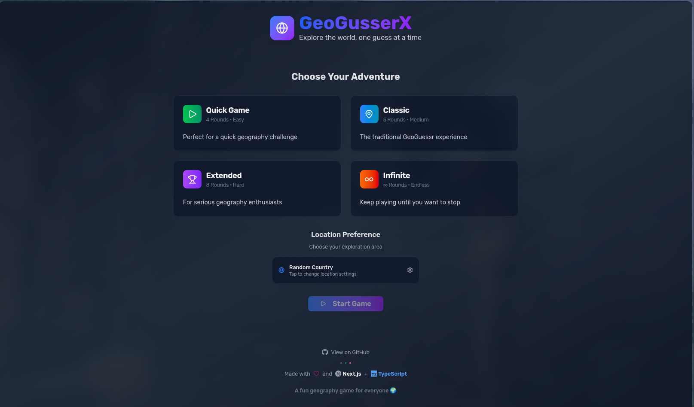
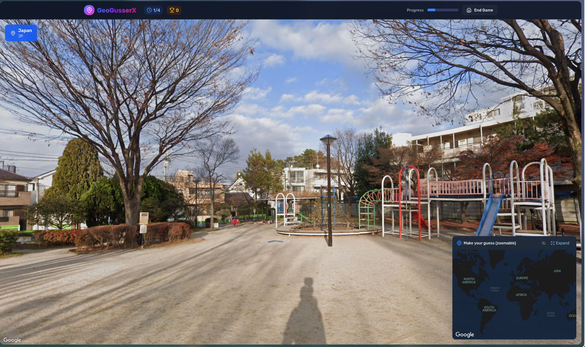
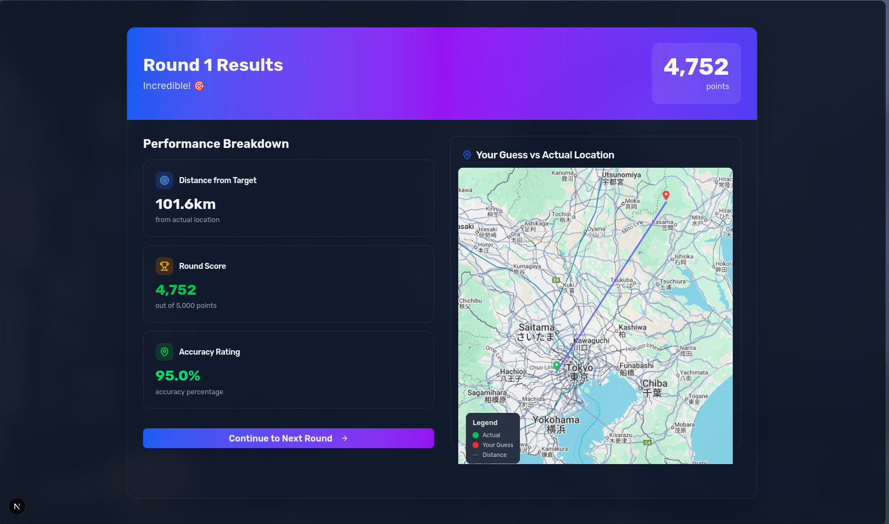
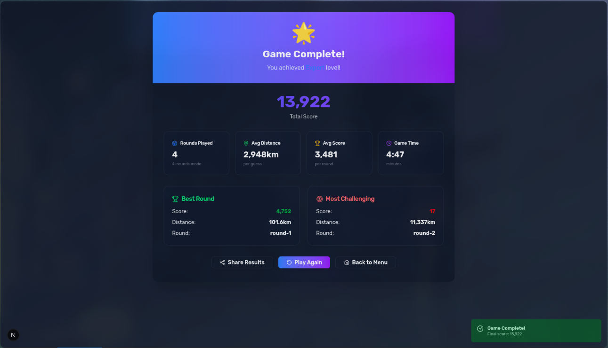

# 🌍 **GeoGusserX**

A modern **single-player GeoGuessr-inspired game** where you explore real-world locations via Street View and guess where you are.

> ⚠ **Disclaimer**: This is a **side project for fun**, built when I felt like experimenting with maps and APIs. No promises for frequent updates or multiplayer mode—if something breaks or you want a feature, PRs are welcome. I keep things **clean and modular**, so contributing should feel natural.


---

## 🔗 **Live Demo**

You can play the live version here: **[GeoGusserX Live](https://geogusserx.vercel.app)**

---

## 📸 **Screenshots**

<div align="center">

### 🏠 Main Menu


*Choose your mode and dive in*

### 🗺️ Gameplay


*Explore Street View & guess the location*

### 📊 Results


*Score breakdown after each round*

### 🏆 Game Complete


*Final results & stats*

</div>

---

## ❓ **What is GeoGusserX?**

Drop into a **random Street View** location anywhere on Earth and guess your position by clicking on the map. **Closer = more points.** Simple, addictive, and challenging.

---

## ✅ **Features**

✔ Multiple game modes:
 • **Quick** (4 rounds)
 • **Classic** (5 rounds)
 • **Extended** (8 rounds)
 • **Endless** (infinite rounds)

✔ Real **Google Street View** integration
✔ Smart **distance-based scoring** (up to 5000 points)
✔ **Country-specific mode** for focused play
✔ **Responsive UI** (desktop + mobile)
✔ **PWA support** – install as an app

---

## ⚡ **Quick Start**

### 1. **Get a Google Maps API Key**

Enable:

* Maps **JavaScript API**
* **Street View Static API**

Create:

* API Key
* Map ID

### 2. **Setup the project**

```bash
git clone https://github.com/Amitminer/GeoGusserX.git
cd GeoGusserX
npm install
```

### 3. **Add credentials**

```bash
cp .env.local.example .env.local
# Add your Google Maps API key & Map ID in .env.local
```

### 4. **Run locally**

```bash
npm run dev
```

Open **[http://localhost:3000](http://localhost:3000)**

---

## 🎮 **How to Play**

1. **Look around** with Street View
2. **Guess on the map** where you think you are
3. **Score points** based on distance
4. **Repeat for all rounds** & see your final score

---

## 📏 **Scoring**

* **Perfect (0 km)** → 5000 pts
* **Very Close (<25 km)** → 4000+ pts
* **Close (<200 km)** → 3000+ pts
* **Decent (<750 km)** → 2000+ pts
* **Far (<2500 km)** → 1000+ pts
* **Way Off (20,000+ km)** → 0 pts

---

## 🐳 **Docker Support**

Run with Docker:

```bash
docker-compose up --build
# OR
docker build -t geogusserx .
docker run -p 3000:3000 -e NEXT_PUBLIC_GOOGLE_MAPS_API_KEY=your_key geogusserx
```

---

## 🤝 **Contributing**

I like **clean, modular, and maintainable** code. If you share the same values, you’re welcome here.

**Steps:**

```bash
git checkout -b feature-name
# Make changes
git push origin feature-name
# Open a PR
```

📜 Check [CONTRIBUTING.md](CONTRIBUTING.md) for code standards & guidelines.

---

## 🛠 **Tech Stack**

* **Frontend:** Next.js (App Router), TypeScript, TailwindCSS
* **Maps:** Google Maps JavaScript API + Street View
* **State:** React hooks + Context API

---

## 📜 **License**

MIT – Free to use, modify, and share.

---

<div align="center">

⭐ **Star this repo** if you like the concept!
🐞 **Issues & PRs welcome**

**Made with** ❤️ **by AmitxD**

[Star on GitHub](https://github.com/Amitminer/GeoGusserX) • [Report Issues](https://github.com/Amitminer/GeoGusserX/issues)

</div>

---
