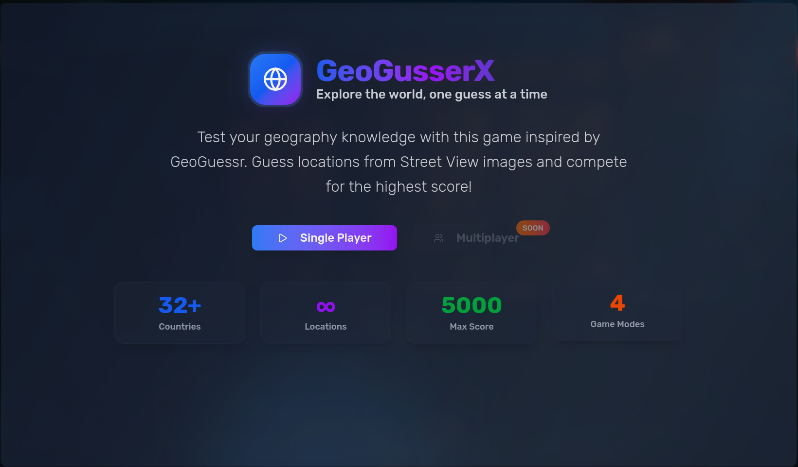
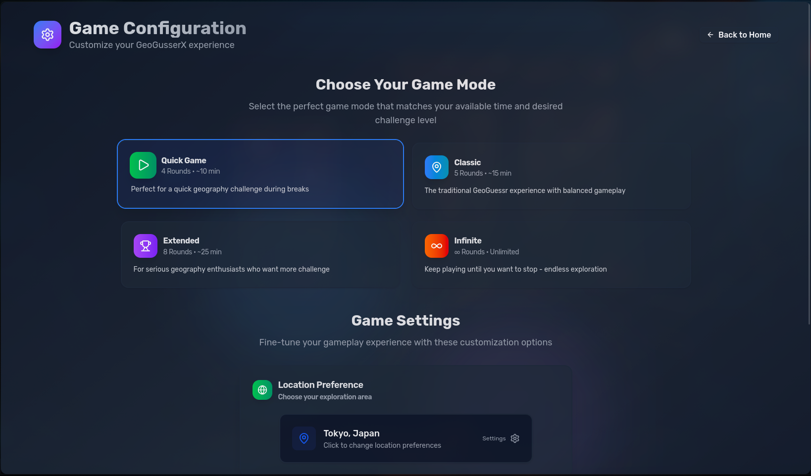
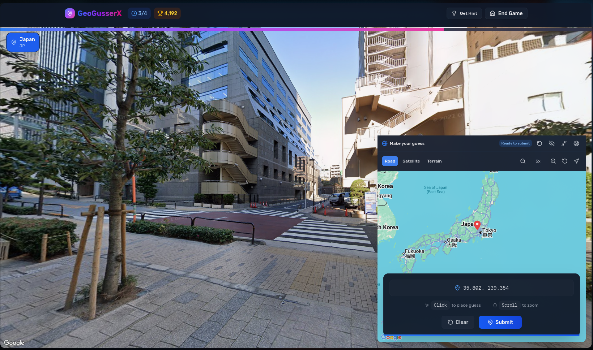
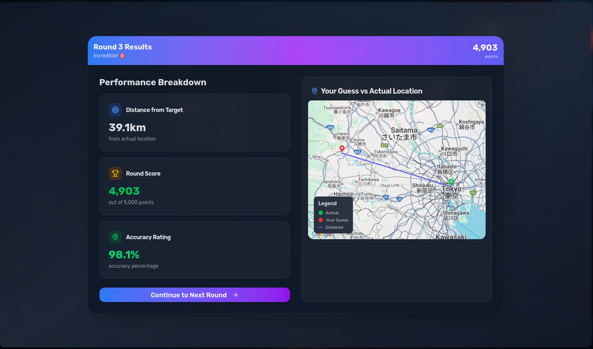
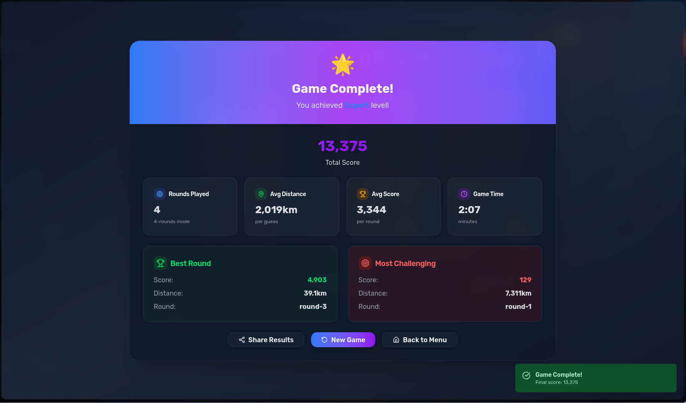

# 🌍 **GeoGusserX**

A modern **single-player GeoGuessr-inspired game** where you explore real-world locations via Street View and guess where you are.

> ⚠ **Disclaimer**: This is a **side project for fun**, built when I felt like experimenting with maps and APIs. No promises for frequent updates or multiplayer mode—if something breaks or you want a feature, PRs are welcome. I keep things **clean and modular**, so contributing should feel natural.


---

## 🔗 **Live Demo**

You can play the live version here: **[GeoGusserX Live](https://geogusserx.vercel.app)**

---

## 📸 **Screenshots**

<div align="center">

### 🏠 Homepage


*Modern homepage with game modes and features*

### ⚙️ Configuration


*Customize your game settings and preferences*

### 🗺️ Gameplay


*Explore Street View & guess the location*

### 📊 Round Results


*Score breakdown after each round*

### 🏆 Final Results


*Complete game statistics and performance*

</div>

---

## ❓ **What is GeoGusserX?**

Drop into a **random Street View** location anywhere on Earth and guess your position by clicking on the map. **Closer = more points.** Simple, addictive, and challenging.

---

## ✅ **Features**

|  |  |
|:--|:--|
| 🕹️ **Multiple Game Modes** | Quick (4 rounds), Classic (5), Extended (8), Endless |
| 🌐 **Google Street View** | Real, immersive exploration anywhere on Earth |
| 📏 **Distance-based Scoring** | Up to 5000 points for perfect guesses |
| 🗺️ **Country Mode** | Focus your challenge within a single country |
| 🤖 **AI-Powered Hints** | Get strategic hints using Google Gemini AI (300 points) |
| 👁️ **Country Name Toggle** | Show/hide country names for difficulty control |
| 📱 **Responsive UI** | Looks great on desktop & mobile |
| 💾 **PWA Support** | Install & play as a standalone app |
| ⚡ **Fast Gameplay** | Minimal load times, smooth transitions |

---

## ⚡ **Quick Start**

### 1. **Get API Keys**

**Google Maps API:**
* Enable: Maps **JavaScript API**, **Street View Static API**
* Create: API Key & Map ID

**Google Gemini API (for AI hints):**
* Get your free API key from [Google AI Studio](https://aistudio.google.com/app/apikey)
* Add to `.env.local` as `GEMINI_API_KEY`

### 2. **Setup the project**

```bash
git clone https://github.com/Amitminer/GeoGusserX.git
cd GeoGusserX
npm install
```

### 3. **Add credentials**

```bash
cp .env.local.example .env.local
# Add your API keys in .env.local:
# - Google Maps API key & Map ID
# - Google Gemini API key (for AI hints)
```

### 4. **Run locally**

```bash
npm run dev
```

Open **[http://localhost:3000](http://localhost:3000)**

---

## 🎮 **How to Play**

1. **Look around** with Street View
2. **Use AI hints** if you're stuck (costs 300 points)
3. **Guess on the map** where you think you are
4. **Score points** based on distance
5. **Repeat for all rounds** & see your final score

### 🤖 **AI Hints System**

- **Cost:** 300 points per hint
- **Powered by:** Google Gemini AI
- **Strategic hints** about geography, culture, architecture, and more
- **Smart analysis** of your current Street View location
- **Use wisely** - hints cost points but can save you from terrible guesses!

---

## 📏 **Scoring**

* **Perfect (0 km)** → 5000 pts
* **Very Close (<25 km)** → 4000+ pts
* **Close (<200 km)** → 3000+ pts
* **Decent (<750 km)** → 2000+ pts
* **Far (<2500 km)** → 1000+ pts
* **Way Off (20,000+ km)** → 0 pts

---

## 🐳 **Docker Support**

Run with Docker:

```bash
docker-compose up --build
# OR
docker build -t geogusserx .
docker run -p 3000:3000 -e NEXT_PUBLIC_GOOGLE_MAPS_API_KEY=your_key geogusserx
```

---

## 🤝 **Contributing**

I like **clean, modular, and maintainable** code. If you share the same values, you’re welcome here.

**Steps:**

```bash
git checkout -b feature-name
# Make changes
git push origin feature-name
# Open a PR
```

📜 Check [CONTRIBUTING.md](CONTRIBUTING.md) for code standards & guidelines.

---

## 🛠 **Tech Stack**

* **Frontend:** Next.js (App Router), TypeScript, TailwindCSS
* **Maps:** Google Maps JavaScript API + Street View
* **State:** React hooks + Context API

---

## 📚 **Documentation**

* **[Algorithm.md](Algorithm.md)** - Detailed documentation of our location generation algorithm, including cryptographic randomness, distribution strategies, and geographic calculations

---

## 📜 **License**

MIT – Free to use, modify, and share.

---

<div align="center">

⭐ **Star this repo** if you like the concept!
🐞 **Issues & PRs welcome**

**Made with** ❤️ **by AmitxD**

[Star on GitHub](https://github.com/Amitminer/GeoGusserX) • [Report Issues](https://github.com/Amitminer/GeoGusserX/issues)

</div>

---
